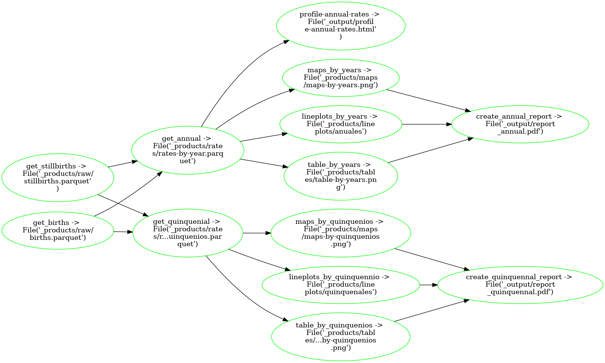

# Stillbirths project 

Using ploomber pipelines:

```
> conda activate algun-environment
> ./install_packages.sh
> cd provincial
> ploomber build
```

## Departamental pipeline:


## Provincial pipeline:




